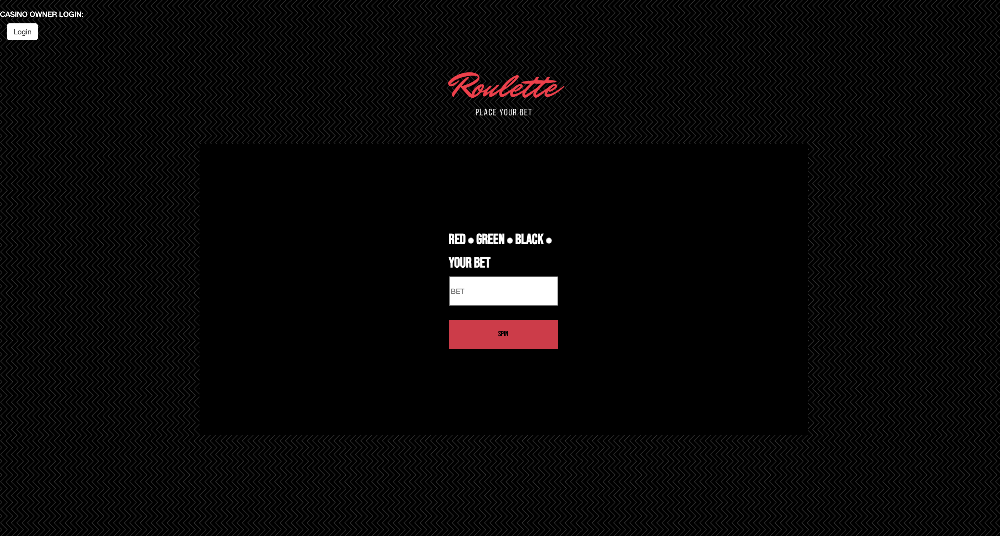

# Roulette Full Stack Application

# Description: 

Created a web application that allows any user to bet any amount and a color, once the user hits submit it will let them know if they've won or lost. Casino owner is able to log-in see the bank, how much users have lost and won.
# Tech Used:

 HTML, CSS, JS, API, JSON, NODE.JS, EXPRESS, MONGODB, USER AUTH